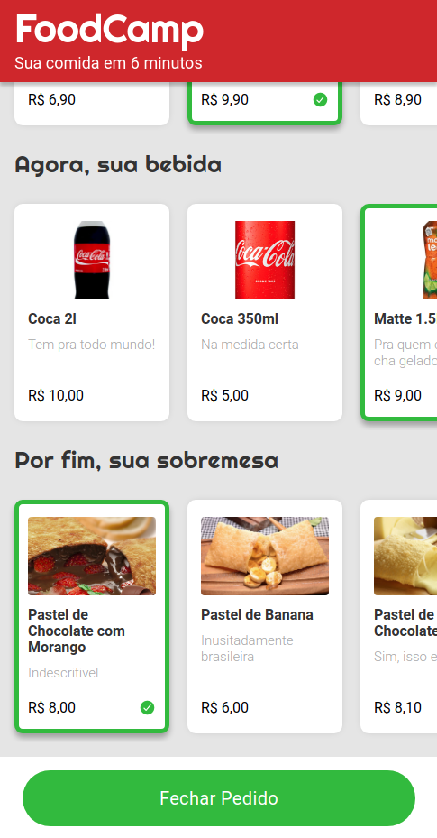

# Foodcamp

The goal of this project is to create a food ordering website that lets users choose one item per category for a total of 3 items. As requested, no attention was given to the desktop version of the website, hence the odd-looking layout and scrollbars.
To achieve this, the project makes use of HTML5, CSS3, and vanilla JavaScript.

## Built With

- HTML5 , CSS3 , JavaScript
- Windows, Linux

## Live Demo

[Live Demo Link](https://vitorelourenco.github.io/foodcamp/)

## Authors

👤 **Vitor Emanuel Lourenco**

- GitHub: [@vitorelourenco](https://github.com/vitorelourenco)
- Twitter: [@Vitorel](https://twitter.com/Vitorel)
- LinkedIn: [vitoremanuellourenco](https://www.linkedin.com/in/vitoremanuellourenco/)

## 🤝 Contributing

Contributions, issues, and feature requests are welcome!

Feel free to check the [issues page](https://github.com/vitorelourenco/foodcamp/issues).

## Show your support

Give a ⭐️ if you like this project!

## Acknowledgments

- RespondeAi (https://www.respondeai.com.br/)
- The Odin Project (https://www.theodinproject.com/)

## 📝 License

This project is [MIT](lic.url) licensed.

